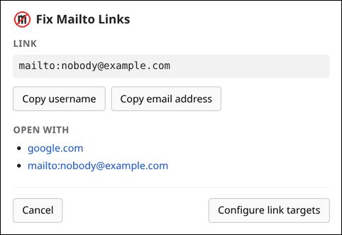
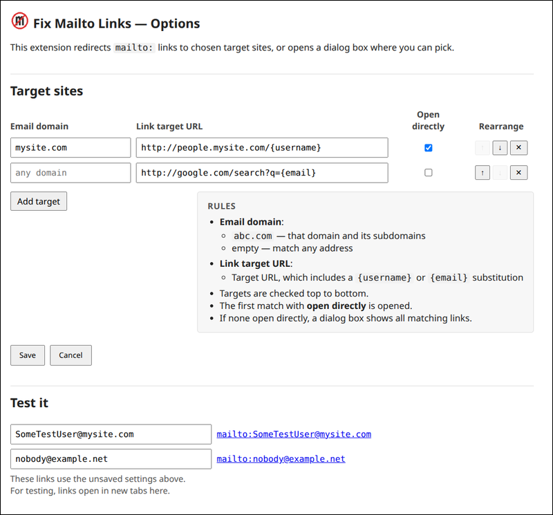

#  Fix Mailto Links Chrome Extension

Mailto links are annoying. I never want to open an email app outside the browser,
or slowly start another gmail tab.

This chrome extension redirects clicks on `mailto:` links to configured
target pages instead of your email app, or opens a dialog box where
you can pick the target page or copy the email address.

Typically, you might prefer linking into your people directory rather than
opening an email client.

The link dialog:

<!-- Both screenshots are stored at the size the UI really is on screen
     (the dialog is 30rem wide, the options page 52rem), so they render
     1:1 here and still shrink on a narrow window. -->


## Configuration

Click the toolbar icon to open the Options page, where you configure the
target links.

- There's an ordered list of rules, optionally matching by the email's
  domain, each with a target link.
- A target link is an `http://` or `https://` URL containing `{email}`
  (the whole address) or `{username}` (the part before the `@`).
- These either open the first match directly, or open a dialog box
  showing all matching targets.
- "Test it" tries an address against the rules currently on screen,
  before you save them.

Settings sync with your Chrome profile.

The Options page:



## Privacy

The extension collects nothing and makes no network requests. Your rules
are stored in Chrome's synced extension storage; email addresses are read
from the link you click and only ever sent to the target site your own
rule points at.

See [PRIVACY.md](PRIVACY.md) for the full policy.

## Installation

### From a release zip

1. Download `FixMailtoLinks-vX.Y.Z.zip` from the
   [Releases page](https://github.com/jshute96/FixMailtoLinks/releases)
   and unzip it.
2. In Chrome: open `chrome://extensions`, enable **Developer mode**,
   click **Load unpacked**, and select the unzipped directory.

### From source

1. Clone this repo and install dependencies:
   ```bash
   git clone https://github.com/jshute96/FixMailtoLinks.git
   cd FixMailtoLinks
   pnpm install
   ```
2. Build the extension:
   ```bash
   pnpm run build
   ```
3. In Chrome: open `chrome://extensions`, enable **Developer mode**,
   click **Load unpacked**, and select the `dist/` directory.

## Development setup

```bash
pnpm install
pnpm exec playwright install chromium
```

## Building

```bash
pnpm run build        # one-shot build into dist/
pnpm run watch        # rebuild on TS changes
```

## Testing

```bash
pnpm test             # run Playwright e2e tests
pnpm run test:headed  # same, with a visible browser
pnpm run typecheck    # typecheck the test suite (tsc doesn't cover tests/)
```

`pnpm test` rebuilds `dist/` first, then drives a real Chromium with the
extension loaded against the fixture pages in `tests/fixtures/pages/`.
See the Testing section of `docs/architecture.md` for how the harness
works and the gotchas it encodes.

### Test pages

Useful for trying the extension interactively:

- [`link_page.html`](tests/fixtures/pages/link_page.html) — mailto links
  in various shapes, including dynamically added links.
- [`iframe_page.html`](tests/fixtures/pages/iframe_page.html) — links
  inside `about:blank` and `srcdoc` frames.

## Releasing

Cut a GitHub release with `scripts/release-extension.sh` (tag `vX.Y.Z`).

1. Bump the version in **both** `package.json` and `src/manifest.json`
   to the same value, and commit.
2. From a clean `main`, run:
   ```bash
   scripts/release-extension.sh             # draft (default)
   scripts/release-extension.sh --publish   # publish immediately
   ```

The script verifies the versions match, `main` is clean and in sync with
`origin/main`, and the tag is unused; then builds + zips the extension as
`/tmp/FixMailtoLinks-vX.Y.Z.zip`, creates and pushes an annotated tag, and
calls `gh release create` (the [GitHub CLI](https://cli.github.com/)) with
auto-generated notes and the zip attached. The default is a draft so you can
review and publish from the GitHub UI.

To build a distributable zip without releasing:

```bash
scripts/zip_extension.sh   # writes /tmp/FixMailtoLinks.zip
```

## Layout

- `src/` — TypeScript sources and `manifest.json`
- `dist/` — built extension (gitignored, loaded unpacked into Chrome)
- `scripts/build.mjs` — build script (cleans `dist/`, copies icons,
  manifest and `options.html`, runs `tsc`)
- `scripts/zip_extension.sh` — builds and zips `dist/` for distribution
- `scripts/release-extension.sh` — cuts a tagged GitHub release with the
  zip attached
- `tests/e2e/` — Playwright tests
- `tests/fixtures/extension.ts` — fixtures that load the extension,
  expose its service worker, serve the fixture pages, and reset config
- `tests/fixtures/pages/` — HTML pages the tests (and you) load
- `docs/` — design docs and the file index
